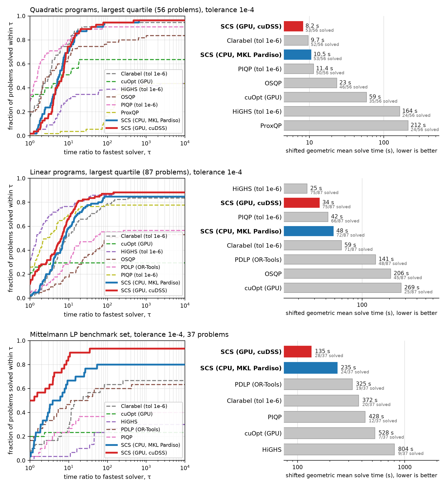
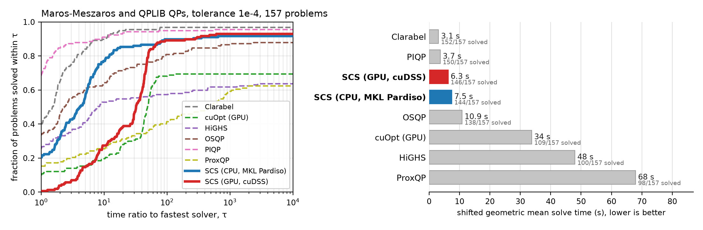
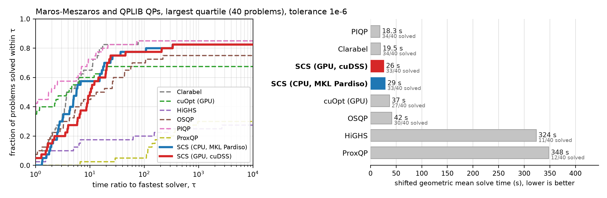
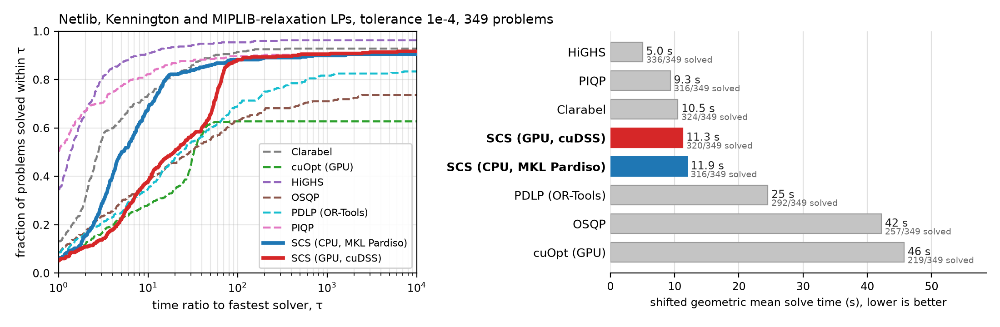
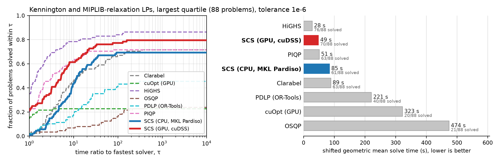
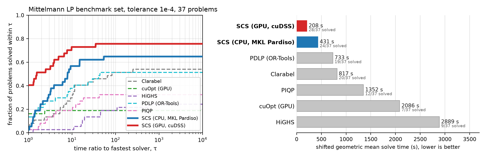
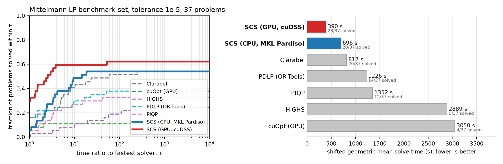
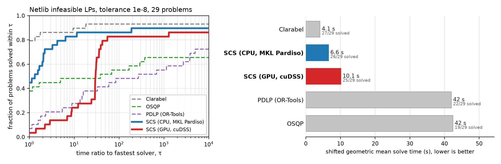
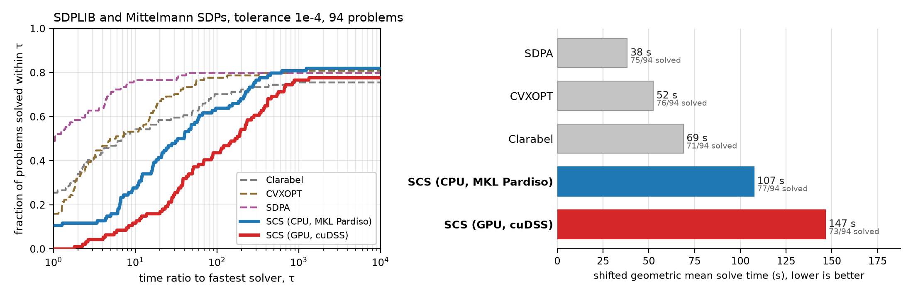
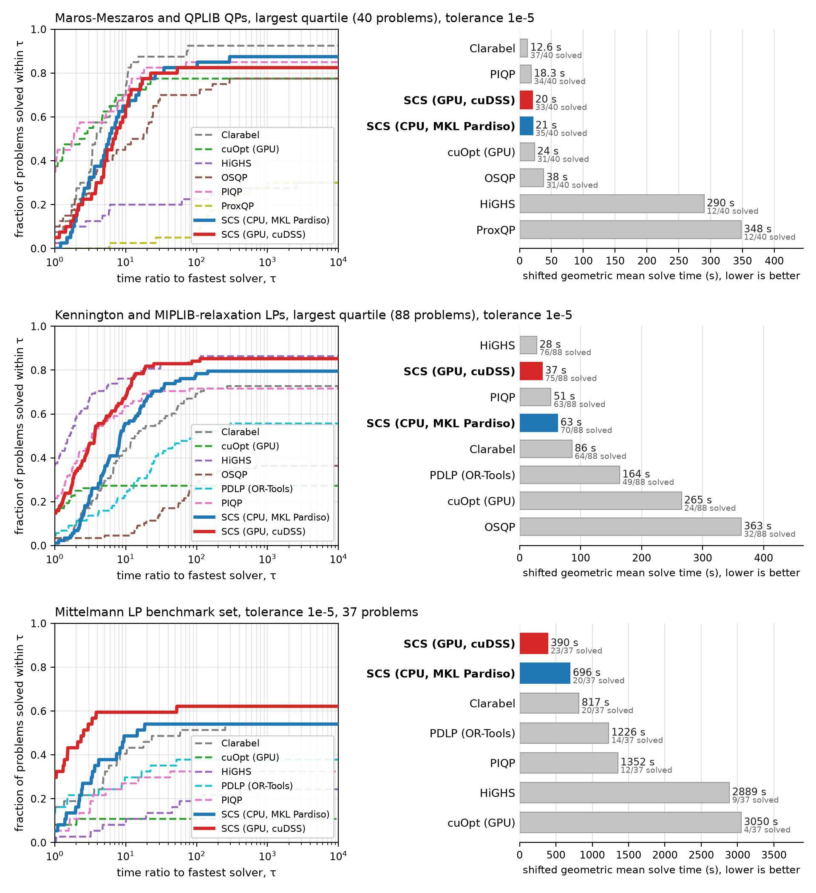

.. _benchmarks:

Benchmarks
==========

This page compares SCS 3.3 against other open-source solvers on standard
quadratic program (QP), linear program (LP) and semidefinite program (SDP)
test sets. All results were produced with the open
`solver_benchmarks <https://github.com/bodono/solver_benchmarks>`_ harness,
which feeds every solver the same problem in its native form, applies the same
time limit, and then checks every returned solution independently. The raw
results, the campaign configuration and the plotting scripts live in that
repository, so every number here can be regenerated.

The short version: SCS 3.3 matches the best open-source interior-point codes
on the QP and LP test sets and is clearly ahead of every other first-order
solver. The cuDSS GPU backend is the fastest solver we tested on the largest
quarter of the QP problems, and on the large LPs of the Mittelmann set SCS
with cuDSS solves more instances than any other solver, in less than half the
geometric mean time of the runner-up.

.. _bench_headline:

Headline results
----------------

The three rows a user is most likely to care about, at a target accuracy of
:math:`10^{-4}`: the largest quarter of the QP test sets, the largest quarter
of the LP test sets, and the Mittelmann large-LP set. Left, the fraction of
problems solved within a factor :math:`\tau` of the fastest solver on each
problem; right, the shifted geometric mean solve time with the number of
verified solves. The same figure is on the front page; the sections below
give the full test sets, the tighter-tolerance results and the methodology.

.. _bench_method:

Methodology
-----------

**Verification.** A solver's own "optimal" status is not taken at face value.
For every returned solution the harness recomputes the relative primal
residual, dual residual and duality gap from the problem data, and a solve
counts as a success only when all three are below ten times the requested
tolerance (so :math:`10^{-3}` for the :math:`10^{-4}` runs and :math:`10^{-5}`
for the :math:`10^{-6}` runs). A solve that a solver reports as optimal but
whose residuals fail this check is counted as a failure; a solve reported as
inaccurate or timed out whose residuals pass is counted as a success. This
matters because solvers define "relative tolerance" differently, and because
first-order methods, SCS included, occasionally declare convergence on badly
scaled problems where the unscaled residuals are large. Applying the same
independent check to every solver makes the comparison tolerance-fair.

**Tolerances.** Every solver was run at requested tolerances of
:math:`10^{-4}`, :math:`10^{-5}` and :math:`10^{-6}` (the interior-point and
simplex solvers at :math:`10^{-6}`, and Clarabel additionally at its default
:math:`10^{-8}` on the SDP sets), passing the value through each solver's own
absolute and relative settings; for SCS this means ``eps_abs = eps_rel = tol``
with the iteration limit raised so that only the time limit can stop it. For
reference, the solvers' own defaults are :math:`10^{-4}` for SCS and cuOpt,
:math:`10^{-3}` for OSQP, :math:`10^{-5}` (absolute only) for ProxQP,
:math:`10^{-6}` for OR-Tools PDLP and :math:`10^{-7}` to :math:`10^{-8}` for
the interior-point codes, each in its own measure of the residual.

A requested tolerance means different things to different solvers, so the
plots do not pair runs by the number requested. Each plot has a target
accuracy (:math:`10^{-4}` for the headline plots), every returned solution is
checked against it with the same residuals, and each solver is shown from the
run whose 90th-percentile residual over its verified solves is closest to
that target. For the headline plots that is the :math:`10^{-4}` run for SCS,
OSQP and cuOpt, the :math:`10^{-5}` run for PDLP and ProxQP, whose own
stopping rules are looser in this measure, and the :math:`10^{-6}` run
(:math:`10^{-8}` on SDP) for the interior-point solvers, which reach that
accuracy at little extra cost and would be shown faster than any user sees
them at a looser setting. Every solve, whatever was requested, is then
verified independently at ten times the plot's target.

The table below reports the accuracy those runs actually achieved on the
solves that count, measured the same way for everyone: the largest of the
three relative KKT residuals over each solver's verified solves, with the
returns that failed the check excluded for every solver.

.. list-table:: Achieved accuracy of the runs shown in the headline plots: median and 90th percentile of the largest relative KKT residual over each solver's verified solves (returns that fail the check are excluded for every solver)
   :header-rows: 2
   :widths: 20 10 11 11 11 11 11 11 11 11

   * - Solver
     - run
     - QP
     -
     - LP
     -
     - Mittelmann
     -
     - SDP
     -
   * -
     -
     - median
     - 90th
     - median
     - 90th
     - median
     - 90th
     - median
     - 90th
   * - SCS (CPU)
     - 1e-4
     - 1e-5
     - 9e-5
     - 3e-5
     - 9e-5
     - 7e-5
     - 3e-4
     - 1e-4
     - 2e-4
   * - SCS (GPU, cuDSS)
     - 1e-4
     - 2e-5
     - 9e-5
     - 3e-5
     - 9e-5
     - 6e-5
     - 1e-4
     - 1e-4
     - 2e-4
   * - OSQP
     - 1e-4
     - 5e-5
     - 1e-4
     - 6e-5
     - 1e-4
     - --
     - --
     - --
     - --
   * - PDLP (OR-Tools)
     - 1e-5
     - --
     - --
     - 9e-6
     - 1e-4
     - 2e-5
     - 2e-4
     - --
     - --
   * - cuOpt (GPU)
     - 1e-4
     - 4e-8
     - 4e-6
     - 1e-10
     - 8e-5
     - 1e-4
     - 7e-4
     - --
     - --
   * - ProxQP
     - 1e-5
     - 5e-6
     - 1e-4
     - --
     - --
     - --
     - --
     - --
     - --
   * - Clarabel
     - 1e-6
     - 2e-7
     - 1e-6
     - 1e-7
     - 2e-6
     - 2e-7
     - 2e-6
     - 2e-6
     - 3e-5
   * - PIQP
     - 1e-6
     - 8e-10
     - 1e-7
     - 2e-10
     - 5e-8
     - --
     - --
     - --
     - --
   * - HiGHS
     - 1e-6
     - 4e-8
     - 3e-5
     - 7e-16
     - 1e-12
     - --
     - --
     - --
     - --
   * - SDPA
     - 1e-6
     - --
     - --
     - --
     - --
     - --
     - --
     - 2e-7
     - 4e-6
   * - CVXOPT
     - 1e-6
     - --
     - --
     - --
     - --
     - --
     - --
     - 3e-7
     - 6e-5

**Timing.** The reported time is wall-clock time for the solver call, including
any presolve, factorization and GPU transfer, but excluding reading the problem
from disk. QP and LP solves were limited to 300 s and SDP solves to 900 s, passed to each
solver through its own time-limit setting; since wall time also includes
setup and reading, a solve counts only if it finished within the limit plus a
60 s grace, the same for every solver, and the harness killed the worker at
that point regardless of what the solver reported. A
performance profile shows, for each solver, the fraction of all problems in
the set solved within a factor :math:`\tau` of the fastest solver on that
problem; failures never count as solved, so the height of a curve at the
right edge is the solver's success rate. The shifted geometric mean uses a
shift of 10 s and charges each failure three times the time limit (900 s for
QP and LP, 2700 s for SDP, 5400 s for the Mittelmann set), so a failure
always costs more than any successful solve. Times below 10 ms are floored at
10 ms before computing ratios.

**Hardware.** All CPU solvers ran in identical 4-core Linux x86-64 containers
(Modal), on which the ``scs`` wheel selects the MKL Pardiso linear system
solver by default. The two GPU solvers, SCS with cuDSS and NVIDIA cuOpt, ran on
an NVIDIA A100 80GB with 8 host cores. GPU results include host-device transfer
and cuDSS analysis time, so small problems pay a fixed overhead of roughly half
a second.

**Solvers.** SCS 3.3.1 (CPU with MKL Pardiso, and GPU with cuDSS),
Clarabel 0.11.1, PIQP 0.6.4, OSQP 1.1.3, ProxQP 0.7.3 (proxsuite), HiGHS
1.15.1, PDLP from OR-Tools 9.15, NVIDIA cuOpt 26.8.0, CVXOPT 1.3.3 and SDPA
via sdpa-python 0.2.3, each the latest release on PyPI in September
2026. Commercial solvers were not included.

**Problem sets.** QP: Maros-Meszaros (138) and the QPLIB continuous convex
subset (19). LP: Netlib (feasible), Kennington and the root LP relaxations of
all 240 instances of the MIPLIB 2017 benchmark set; the Mittelmann LP set is
its own section. SDP: the 88 feasible SDPLIB instances and the 6 Mittelmann
SDPs; SDPLIB's four infeasible instances (``infd1``, ``infd2``, ``infp1`` and
``infp2``) are reported infeasible by every solver and are left out, since the
plots measure the time to a verified optimum; they and the 29 infeasible
Netlib LPs are used in :ref:`bench_infeasible` instead. "Largest quartile" means the quarter of each family with
the most nonzeros in the constraint matrix (plus the Hessian for QPs).

**Exclusions.** Clarabel was killed at the 64 GB memory limit on
``equalG11``, ``equalG51``, ``maxG55``, ``maxG60`` and ``G40mc``; those count
as failures for it (the notes below list the outcome on every other large
SDP). SDPA does not take a time limit; the harness killed it at the limit plus
grace on ``maxG60``, which counts as a failure.
cuOpt's QP path is an interior-point method whose factorization failed with a
numerical error on a subset of the Maros-Meszaros problems; those count as
failures.

.. _bench_qp:

Quadratic programs
------------------

157 problems: Maros-Meszaros (138) and the convex continuous QPLIB instances
(19). On the largest quarter of these, SCS with cuDSS
has the lowest shifted geometric mean solve time of any solver, SCS on the CPU
sits between Clarabel and PIQP, and the two SCS variants verify the most
solutions. Over all 157 problems the interior-point solvers are faster on the
small instances, where an SCS solve is dominated by fixed setup cost, but SCS
solves nearly as many problems as they do.

At the tighter :math:`10^{-6}` tolerance the interior-point solvers pull ahead,
as expected for a first-order method, but SCS still verifies more solutions
than every solver other than PIQP and Clarabel, and remains the fastest
first-order solver by a wide margin.

.. list-table:: QP: verified solves and shifted geometric mean time (s); all 157 problems / largest quartile (40)
   :header-rows: 1
   :widths: 26 12 12 12 12 12 12 12 12

   * - Solver
     - solved 1e-4
     - gm 1e-4
     - solved 1e-4 (largest)
     - gm 1e-4 (largest)
     - solved 1e-6
     - gm 1e-6
     - solved 1e-6 (largest)
     - gm 1e-6 (largest)
   * - Clarabel
     - 152
     - 3.1
     - 37
     - 12.6
     - 148
     - 4.4
     - 34
     - 19.5
   * - PIQP
     - 150
     - 3.7
     - 34
     - 18.3
     - 150
     - 3.7
     - 34
     - 18.3
   * - SCS (GPU, cuDSS)
     - 146
     - 6.3
     - 38
     - 9.4
     - 140
     - 12.2
     - 33
     - 26.1
   * - SCS (CPU, MKL Pardiso)
     - 144
     - 7.5
     - 38
     - 12.8
     - 138
     - 11.4
     - 33
     - 28.8
   * - OSQP
     - 138
     - 10.9
     - 32
     - 29.4
     - 121
     - 27.2
     - 30
     - 41.8
   * - cuOpt (GPU)
     - 109
     - 33.8
     - 32
     - 22.4
     - 103
     - 39.6
     - 27
     - 37.1
   * - HiGHS
     - 100
     - 48.0
     - 13
     - 268.1
     - 84
     - 79.1
     - 11
     - 323.6
   * - ProxQP
     - 98
     - 67.9
     - 12
     - 346.3
     - 84
     - 88.9
     - 12
     - 348.0

.. _bench_lp:

Linear programs
---------------

349 problems: Netlib (93), Kennington (16) and the root LP relaxations of the
240 MIPLIB 2017 benchmark instances. On the largest quarter of the LP set SCS
with cuDSS verifies the most solutions of any solver and is second only to
HiGHS (dual simplex) in geometric mean time, ahead of the interior-point
solvers PIQP and Clarabel. Both PDLP implementations, which
are first-order LP methods, trail SCS by a wide margin under independent
verification (see the notes below). The first figure is the full 349-problem
set at :math:`10^{-4}`; the second is the largest quarter at
:math:`10^{-6}`.

.. list-table:: LP: verified solves and shifted geometric mean time (s); all 349 problems / largest quartile (88)
   :header-rows: 1
   :widths: 26 12 12 12 12 12 12 12 12

   * - Solver
     - solved 1e-4
     - gm 1e-4
     - solved 1e-4 (largest)
     - gm 1e-4 (largest)
     - solved 1e-6
     - gm 1e-6
     - solved 1e-6 (largest)
     - gm 1e-6 (largest)
   * - HiGHS
     - 336
     - 5.0
     - 76
     - 28.2
     - 336
     - 5.0
     - 76
     - 28.2
   * - PIQP
     - 316
     - 9.3
     - 63
     - 51.5
     - 310
     - 10.6
     - 63
     - 51.5
   * - Clarabel
     - 324
     - 10.5
     - 68
     - 73.5
     - 312
     - 13.4
     - 63
     - 88.9
   * - SCS (GPU, cuDSS)
     - 320
     - 11.3
     - 77
     - 35.6
     - 303
     - 17.0
     - 70
     - 48.6
   * - SCS (CPU, MKL Pardiso)
     - 316
     - 11.9
     - 71
     - 56.5
     - 295
     - 19.9
     - 61
     - 84.7
   * - PDLP (OR-Tools)
     - 292
     - 24.5
     - 52
     - 139.0
     - 263
     - 38.6
     - 40
     - 221.3
   * - OSQP
     - 257
     - 42.2
     - 43
     - 220.1
     - 174
     - 131.9
     - 21
     - 474.3
   * - cuOpt (GPU)
     - 219
     - 45.7
     - 25
     - 255.6
     - 204
     - 56.9
     - 20
     - 322.6

.. _bench_lpbig:

Large linear programs: the Mittelmann set
-----------------------------------------

The LP test sets above are dominated by small and medium instances, so we also
ran the 37 problems of `Hans Mittelmann's LP benchmark set
<https://plato.asu.edu/ftp/lptestset/>`_, the standard collection of large,
hard LPs: between 100,000 and 126 million nonzeros, with several instances of
10 to 40 million variables. Every solver ran at tolerance :math:`10^{-4}`
with an 1800 s limit in 64 GB containers (4 cores, or an A100 80GB for the two
GPU solvers). Mittelmann's own runs allow several hours per instance and use
faster machines, so the simplex and interior-point codes time out here far
more often than they do in his tables; the point of this set for us is the
size of the problems, not a re-run of his benchmark.

This is where the cuDSS backend pays off. SCS on the GPU verifies more
solutions than any other solver and has by far the lowest geometric mean
time, and SCS on the CPU is second. The two other first-order codes, PDLP and
cuOpt, are the natural comparison: OR-Tools PDLP verifies about two thirds as many
solutions as SCS with cuDSS, and cuOpt's PDLP, although it reports almost
every instance optimal, mostly fails the independent residual check (see the
notes below).

The ordering is unchanged at the tighter :math:`10^{-5}` setting, at which
every first-order solver was also run on this set:

.. list-table:: Mittelmann LP set: verified solves out of 37 and shifted geometric mean time (s), tolerance 1e-4, 1800 s limit
   :header-rows: 1
   :widths: 40 20 20

   * - Solver
     - verified solves
     - geometric mean (s)
   * - SCS (GPU, cuDSS)
     - 28
     - 208
   * - SCS (CPU, MKL Pardiso)
     - 24
     - 431
   * - PDLP (OR-Tools)
     - 19
     - 733
   * - Clarabel
     - 20
     - 817
   * - PIQP
     - 12
     - 1352
   * - cuOpt (GPU)
     - 7
     - 2086
   * - HiGHS
     - 9
     - 2889

Set-specific exclusions: Clarabel could not attempt ``L1_sixm250obs`` and
``L1_sixm1000obs`` within 64 GB (counted as failures); OR-Tools PDLP cannot
load ``Dual2_5000`` and ``dlr2`` because the model exceeds the 2 GB protobuf
limit (counted as failures); SCS with cuDSS ran out of GPU memory on
``thk_48`` (counted as a failure). Four instances (``bdry2``, ``Linf_520c``
and the two ``L1_sixm`` problems) are distributed in Netlib's compressed EMPS
format and were decoded with ``emps`` before use.

.. _bench_infeasible:

Infeasible and unbounded problems
---------------------------------

A solver should also recognise when a problem has no solution. We ran every
LP solver on the 29 infeasible LPs of the Netlib collection and every SDP
solver on the four infeasible SDPLIB instances (two primal infeasible, two
unbounded). These are small problems, a median of 460 variables, so this
tests detection rather than speed at scale. SCS, Clarabel, OSQP, PDLP and
CVXOPT return a certificate (a Farkas ray), which the harness checks against
the problem data at the same :math:`10^{-3}` threshold as the plots; HiGHS,
PIQP, cuOpt and SDPA report a status only. A verified certificate of either
kind counts as correct (``cplex1`` and ``mondou2`` are both primal and dual
infeasible). "Near-feasible" means the solver returned a point whose
residuals pass the check: the instance is infeasible by less than the
tolerance asked for, a statement about the tolerance rather than an error.

SCS certifies 24 of the 29 LPs at :math:`10^{-4}`, in 0.2 s geometric
mean, 26 at a solve tolerance of :math:`10^{-8}` with the infeasibility
tolerance kept at :math:`10^{-4}`, and all four SDPs on both backends. Its
misses at :math:`10^{-4}` are four instances infeasible by about the
tolerance (two within the check, two just outside it) and, on ``reactor``, a
certificate of unboundedness that does not verify. Clarabel certifies 27,
HiGHS detects 26 by status, and OSQP and PDLP give no answer on 10 and 5 of
the 29. On the SDPs SDPA gets all four by status, while CVXOPT's certificates
fail the check.

Each solver in the plot is shown from the run in which it certified the most
of all the settings we tried for it: SCS, Clarabel and OSQP at a solve
tolerance of :math:`10^{-8}` with the certificate tolerance at
:math:`10^{-4}` (a tighter solve tolerance is what stops a near-feasible
point from being accepted as optimal), and PDLP at :math:`10^{-5}` with its
default certificate tolerance, which verifies more than a loosened one. A
verified certificate counts as a solve and everything else as a failure,
with the same charge as the other sets. The table shows the same settings
plus SCS at :math:`10^{-4}`; the other runs are in the archive.

.. list-table:: Infeasibility detection, Netlib infeasible LPs (29 problems): verified certificate / correct status without certificate / certificate failing the check / reported optimal with residuals within tolerance / wrong / no answer, and shifted geometric mean time (s) over certified and status answers
   :header-rows: 1
   :widths: 24 11 11 11 11 11 11 12

   * - Solver
     - certified
     - status only
     - unverified
     - near-feasible
     - wrong
     - no answer
     - gm time
   * - SCS (CPU, MKL Pardiso), 1e-4
     - 24
     - 0
     - 0
     - 2
     - 3
     - 0
     - 0.20
   * - SCS (CPU, MKL Pardiso), 1e-8 (infeasibility tolerance 1e-4)
     - 26
     - 0
     - 0
     - 1
     - 1
     - 1
     - 0.44
   * - SCS (GPU, cuDSS), 1e-8 (infeasibility tolerance 1e-4)
     - 25
     - 0
     - 0
     - 1
     - 1
     - 2
     - 0.93
   * - Clarabel, 1e-8 (infeasibility tolerance 1e-4)
     - 27
     - 0
     - 1
     - 1
     - 0
     - 0
     - 0.35
   * - PIQP, 1e-6
     - 0
     - 17
     - 0
     - 0
     - 0
     - 12
     - 0.29
   * - HiGHS, 1e-6
     - 0
     - 26
     - 0
     - 0
     - 0
     - 3
     - 0.02
   * - OSQP, 1e-8
     - 19
     - 0
     - 0
     - 0
     - 0
     - 10
     - 1.68
   * - PDLP (OR-Tools), 1e-5
     - 22
     - 0
     - 2
     - 0
     - 0
     - 5
     - 10.91
   * - cuOpt (GPU), 1e-4
     - 0
     - 27
     - 0
     - 0
     - 1
     - 1
     - 0.40

.. list-table:: Infeasibility detection, SDPLIB infeasible SDPs (4 problems): verified certificate / correct status without certificate / certificate failing the check / reported optimal with residuals within tolerance / wrong / no answer, and shifted geometric mean time (s) over certified and status answers
   :header-rows: 1
   :widths: 24 11 11 11 11 11 11 12

   * - Solver
     - certified
     - status only
     - unverified
     - near-feasible
     - wrong
     - no answer
     - gm time
   * - SCS (CPU, MKL Pardiso)
     - 4
     - 0
     - 0
     - 0
     - 0
     - 0
     - 0.04
   * - SCS (GPU, cuDSS)
     - 4
     - 0
     - 0
     - 0
     - 0
     - 0
     - 0.70
   * - Clarabel
     - 4
     - 0
     - 0
     - 0
     - 0
     - 0
     - 0.20
   * - CVXOPT
     - 0
     - 0
     - 2
     - 0
     - 2
     - 0
     - --
   * - SDPA
     - 0
     - 4
     - 0
     - 0
     - 0
     - 0
     - 0.03

.. _bench_sdp:

Semidefinite programs
---------------------

94 problems: the 88 feasible SDPLIB instances and the 6 Mittelmann SDPs.
This is the family where an interior-point method is the better default, and
the plot says so: SDPA and CVXOPT verify nearly as many problems as SCS in a
fraction of the time. SCS on the CPU has the highest success rate, 77 of 94,
because it is the only solver without a blind spot in this set: SDPA fails
the ``hinf`` and ``qap`` instances, CVXOPT and Clarabel run out of time or
memory on the large sparse relaxations, while SCS's failures are the small,
badly conditioned ``control``, ``truss`` and ``gpp`` instances, on which it
spends hundreds of thousands of iterations and often the whole 900 s limit
where an interior-point solver finishes in seconds. Those slow solves, more
than the failures, are what put SCS last in geometric mean time. On the large
sparse combinatorial relaxations (``theta``, ``mcp``, ``maxG``, ``qpG`` and
``equalG``, 31 instances) SCS verifies 28 on the CPU and 29 on the GPU, but
SDPA verifies 30, including ``maxG55`` with a PSD block of order 5000, so
even there SCS is not ahead. The GPU does not help on SDPs: the time goes into
the eigendecompositions of the cone projection, not the linear system.

Use an interior-point solver for SDPs when it fits in memory. SCS is the
fallback when it does not (Clarabel and CVXOPT run out of memory or time on
the largest instances here), or when a moderately accurate solution is enough
and SCS is already solving the rest of your problems.

.. list-table:: SDP: verified solves and shifted geometric mean time (s); all 94 problems / largest quartile (24)
   :header-rows: 1
   :widths: 26 12 12 12 12

   * - Solver
     - solved 1e-4
     - gm 1e-4
     - solved 1e-4 (largest)
     - gm 1e-4 (largest)
   * - SDPA
     - 75
     - 38.2
     - 21
     - 38.6
   * - CVXOPT
     - 76
     - 52.4
     - 18
     - 111.5
   * - Clarabel
     - 71
     - 68.9
     - 13
     - 257.0
   * - SCS (CPU, MKL Pardiso)
     - 77
     - 107.5
     - 14
     - 1090.7
   * - SCS (GPU, cuDSS)
     - 73
     - 146.5
     - 9
     - 1531.0

.. _bench_sens:

Sensitivity to the requested tolerance
--------------------------------------

The headline plots target :math:`10^{-4}`. To show what a tighter target
costs, the same three rows are repeated with a target of :math:`10^{-5}`,
every solve verified at :math:`10^{-4}`, and each solver again shown from the
run whose achieved accuracy is closest to the target: the :math:`10^{-5}` run
for SCS, OSQP and cuOpt, the :math:`10^{-6}` run for PDLP and ProxQP, and the
interior-point rows unchanged.

The LP picture barely moves and the Mittelmann set is still led by SCS with
cuDSS and SCS on the CPU, with a smaller margin. The QP row is where the
tolerance matters: SCS loses a few of the largest instances to the time limit
and its geometric mean roughly doubles, so at :math:`10^{-5}` Clarabel and
PIQP are faster on the largest QPs while SCS still matches Clarabel on the
number solved. The other first-order solvers lose more than SCS does from the
tighter request, OSQP and PDLP a quarter to a third of their large solves, so
SCS's margin over them widens. cuOpt's verified LP count barely changes
between its runs, since its failures are dual-residual failures rather than
tolerance ones.

.. list-table:: Verified solves and shifted geometric mean time (s) at the 1e-4 and 1e-5 settings; interior-point solvers unchanged (shown from their tightest run in both)
   :header-rows: 1
   :widths: 30 24 12 12 12 12

   * - Problem set
     - Solver
     - solved 1e-4
     - time 1e-4
     - solved 1e-5
     - time 1e-5
   * - Maros-Meszaros and QPLIB QPs, largest quartile (40)
     - Clarabel
     - 37
     - 13
     - 37
     - 13
   * - 
     - PIQP
     - 34
     - 18
     - 34
     - 18
   * - 
     - SCS (GPU, cuDSS)
     - 38
     - 9
     - 33
     - 20
   * - 
     - SCS (CPU, MKL Pardiso)
     - 38
     - 13
     - 35
     - 21
   * - 
     - cuOpt (GPU)
     - 32
     - 22
     - 31
     - 24
   * - 
     - OSQP
     - 32
     - 29
     - 31
     - 38
   * - 
     - HiGHS
     - 13
     - 268
     - 12
     - 290
   * - 
     - ProxQP
     - 12
     - 346
     - 12
     - 348
   * - Kennington and MIPLIB-relaxation LPs, largest quartile (88)
     - HiGHS
     - 76
     - 28
     - 76
     - 28
   * - 
     - SCS (GPU, cuDSS)
     - 77
     - 36
     - 75
     - 37
   * - 
     - PIQP
     - 63
     - 51
     - 63
     - 51
   * - 
     - SCS (CPU, MKL Pardiso)
     - 71
     - 57
     - 70
     - 63
   * - 
     - Clarabel
     - 68
     - 74
     - 64
     - 86
   * - 
     - PDLP (OR-Tools)
     - 52
     - 139
     - 49
     - 164
   * - 
     - cuOpt (GPU)
     - 25
     - 256
     - 24
     - 265
   * - 
     - OSQP
     - 43
     - 220
     - 32
     - 363
   * - Mittelmann LP set (37)
     - SCS (GPU, cuDSS)
     - 28
     - 208
     - 23
     - 390
   * - 
     - SCS (CPU, MKL Pardiso)
     - 24
     - 431
     - 20
     - 696
   * - 
     - Clarabel
     - 20
     - 817
     - 20
     - 817
   * - 
     - PDLP (OR-Tools)
     - 19
     - 733
     - 14
     - 1226
   * - 
     - PIQP
     - 12
     - 1352
     - 12
     - 1352
   * - 
     - HiGHS
     - 9
     - 2889
     - 9
     - 2889
   * - 
     - cuOpt (GPU)
     - 7
     - 2086
     - 4
     - 3050

Notes on individual solvers
---------------------------

* **SCS.** A few SCS "solved" returns fail the independent residual check
  and count as failures above. Two of them are real false certificates
  (``QGROW7`` and ``QGROW22`` from Maros-Meszaros, and the MIPLIB relaxation
  ``neos-4413714-turia``): on these badly scaled problems the diagonal
  rescaling drives the internal scale to its floor, and the scaled residuals
  SCS monitors no longer track the unscaled ones.
* **cuOpt.** cuOpt's LP path is PDLP with an L2-relative stopping rule, and on
  problems with many variable bounds (Kennington, MIPLIB) its returned duals
  often have large infinity-norm stationarity residuals even though cuOpt
  reports the solve as optimal, and even though its own reported absolute
  dual residual is between :math:`3\times10^{1}` and :math:`3\times10^{2}`. Under the uniform check used here
  those solves count as failures, while the returns that do pass are very
  accurate (median residual around :math:`10^{-10}`), so the requested
  tolerance changes little. It is shown from its :math:`10^{-4}` run, which
  reports 331 of the 349 LPs optimal, of which 223 pass the check, and all 37
  Mittelmann instances, of which 7 pass. Its QP path is a
  barrier method whose solutions verify cleanly. We used cuOpt 26.8.0 with default settings apart
  from the tolerance and time limit.
* **PDLP (OR-Tools).** The same L2-relative termination rule applies, with a
  milder effect: at a requested :math:`10^{-4}`, 28 of its 311 "optimal" LP
  returns have infinity-norm residuals above :math:`10^{-3}`. It is shown
  from its :math:`10^{-5}` run, where 2 of 297 do.
* **HiGHS.** Its QP solver is an active-set method and is slow on the larger
  QPs; its LP simplex is the fastest LP code in the comparison.
* **ProxQP.** Run with its default dense/sparse backend selection; it times
  out on many of the larger problems.
* **Clarabel.** Shown from its :math:`10^{-6}` run on QP and LP and from its
  default :math:`10^{-8}` run on SDP, where its termination test leaves the
  loosest unscaled residuals of any solver at a given setting. Every SDPLIB
  instance with a PSD block of order 500 or more was run on its own in a
  64 GB container: Clarabel solves ``maxG11``, ``maxG32``, ``thetaG11``,
  ``qpG11``, ``mcp500-1`` and ``mcp500-2``; reaches the 900 s limit on
  ``maxG51``, ``qpG51``, ``thetaG51``, ``mcp500-3``, ``mcp500-4`` and
  ``gpp500-1`` to ``gpp500-4``; and is killed at the memory limit on
  ``equalG11``, ``equalG51``, ``maxG55``, ``maxG60`` and the Mittelmann
  ``G40mc``.
* **SDPA and CVXOPT.** Interior-point SDP solvers. SDPA does not take a time
  limit; its longest verified solve was 795 s (``maxG55``), inside the 900 s
  limit, and it was killed at the limit on ``maxG60``.
