.. _benchmarks:

Benchmarks
==========

This page compares SCS 3.3 against other open-source solvers on standard
quadratic program (QP), linear program (LP) and semidefinite program (SDP)
test sets. All results were produced with the open
`solver_benchmarks <https://github.com/bodono/solver_benchmarks>`_ harness,
which feeds every solver the same problem in its native form, applies the same
time limit, and then checks every returned solution independently. The raw
results, the campaign configuration and the plotting scripts live in that
repository, so every number here can be regenerated.

The short version: on the QP and LP test sets SCS is competitive with the best
interior-point codes and clearly ahead of the other first-order solvers, the
cuDSS GPU backend is the fastest solver we tested on the largest quarter of the
QP problems, and on the large LPs of the Mittelmann set SCS with cuDSS solves
more instances than any other solver. On the SDP test sets the interior-point solvers are faster on
the small, ill-conditioned control and truss instances, while SCS is the
fastest solver on the large sparse combinatorial relaxations; see
:ref:`bench_sdp` before choosing a solver for semidefinite problems.

.. _bench_method:

Methodology
-----------

**Verification.** A solver's own "optimal" status is not taken at face value.
For every returned solution the harness recomputes the relative primal
residual, dual residual and duality gap from the problem data, and a solve
counts as a success only when all three are below ten times the requested
tolerance (so :math:`10^{-3}` for the :math:`10^{-4}` runs and :math:`10^{-5}`
for the :math:`10^{-6}` runs). A solve that a solver reports as optimal but
whose residuals fail this check is counted as a failure; a solve reported as
inaccurate or timed out whose residuals pass is counted as a success. This
matters because solvers define "relative tolerance" differently, and because
first-order methods, SCS included, occasionally declare convergence on badly
scaled problems where the unscaled residuals are large. Applying the same
independent check to every solver makes the comparison tolerance-fair.

**Tolerances.** The first-order solvers (SCS, OSQP, ProxQP, PDLP and cuOpt)
were run at a requested relative tolerance of :math:`10^{-4}`, which is also
SCS's default, for the headline plots, and at :math:`10^{-6}` for the
high-accuracy plots, passing the tolerance through each solver's own absolute
and relative settings; for SCS this means ``eps_abs = eps_rel = tol`` with the
iteration limit raised so that only the time limit can stop it. The
interior-point and simplex solvers (Clarabel, PIQP, HiGHS, SDPA and CVXOPT)
are shown from their :math:`10^{-6}` runs in every plot. Nobody runs an interior-point solver at :math:`10^{-4}`: their defaults
are :math:`10^{-7}` to :math:`10^{-8}`, the last few iterations are nearly
free, and a loose setting would show them faster than a user ever sees them.
It also removes a real comparability problem: Clarabel's termination test can
leave large unscaled residuals when some terms in it are very large, and at
:math:`10^{-4}` on the SDP sets its solutions were up to a hundred times
looser than everyone else's. Every solve, whatever was requested, is then
verified independently at ten times the plot's tolerance.

A requested tolerance means different things to different solvers, so the
table below reports the accuracy actually achieved, measured the same way for
everyone: the largest of the three relative KKT residuals over the solves each
solver itself reported optimal, at the :math:`10^{-4}` setting. The
first-order solvers land at the requested tolerance; the interior-point and
simplex codes overshoot it by orders of magnitude, except Clarabel on SDP;
cuOpt's LP path and ProxQP have a long tail of returns that are far from
optimal.

.. list-table:: Achieved accuracy: median and 90th percentile of the largest relative KKT residual over the solves each solver reported optimal, at the 1e-4 and 1e-6 settings
   :header-rows: 2
   :widths: 22 13 13 13 13 13 13

   * - Solver
     - QP 1e-4
     -
     - LP 1e-4
     -
     - SDP 1e-4
     -
   * -
     - median
     - 90th
     - median
     - 90th
     - median
     - 90th
   * - SCS (CPU)
     - 1e-5
     - 1e-4
     - 3e-5
     - 9e-5
     - 9e-5
     - 1e-4
   * - SCS (GPU, cuDSS)
     - 2e-5
     - 9e-5
     - 3e-5
     - 1e-4
     - 8e-5
     - 1e-4
   * - OSQP
     - 3e-5
     - 1e-4
     - 6e-5
     - 1e-4
     - --
     - --
   * - PDLP (OR-Tools)
     - --
     - --
     - 1e-4
     - 8e-4
     - --
     - --
   * - ProxQP
     - 8e-5
     - 3e-2
     - --
     - --
     - --
     - --
   * - cuOpt (GPU)
     - 2e-8
     - 1e-6
     - 1e-4
     - 1e+00
     - --
     - --
   * - Clarabel
     - 1e-5
     - 6e-5
     - 2e-5
     - 1e-4
     - 3e-4
     - 5e-3
   * - PIQP
     - 4e-10
     - 1e-7
     - 2e-10
     - 6e-8
     - --
     - --
   * - HiGHS
     - 1e-7
     - 3e-4
     - 8e-16
     - 1e-10
     - --
     - --
   * - CVXOPT
     - --
     - --
     - --
     - --
     - 2e-5
     - 8e-5

.. _bench_qp:

Quadratic programs
------------------

221 problems: Maros-Meszaros (138), the convex continuous QPLIB instances and
the ``qpbenchmark`` MPC set. On the largest quarter of these, SCS with cuDSS
has the lowest shifted geometric mean solve time of any solver, SCS on the CPU
sits between Clarabel and PIQP, and the two SCS variants verify the most
solutions. Over all 221 problems the interior-point solvers are faster on the
small instances, where an SCS solve is dominated by fixed setup cost, but SCS
solves nearly as many problems as they do.

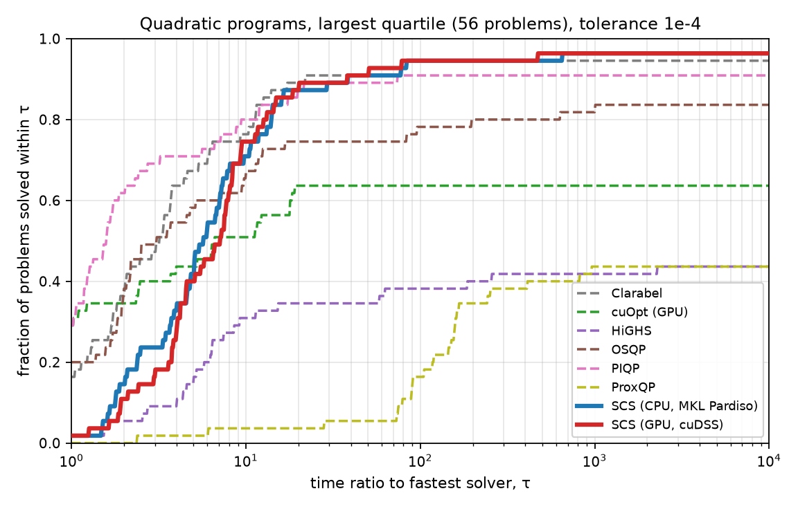

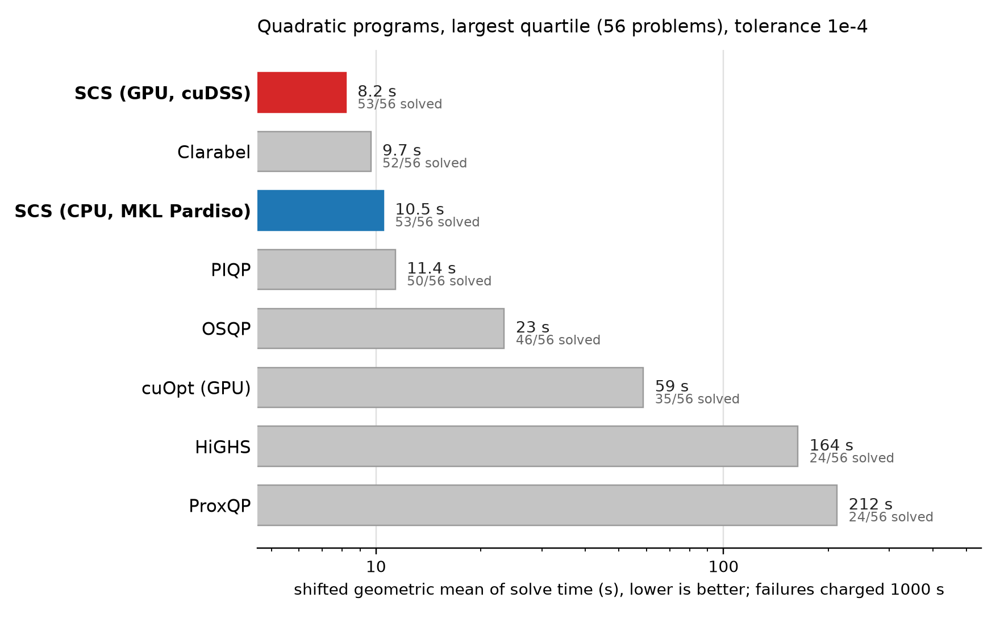

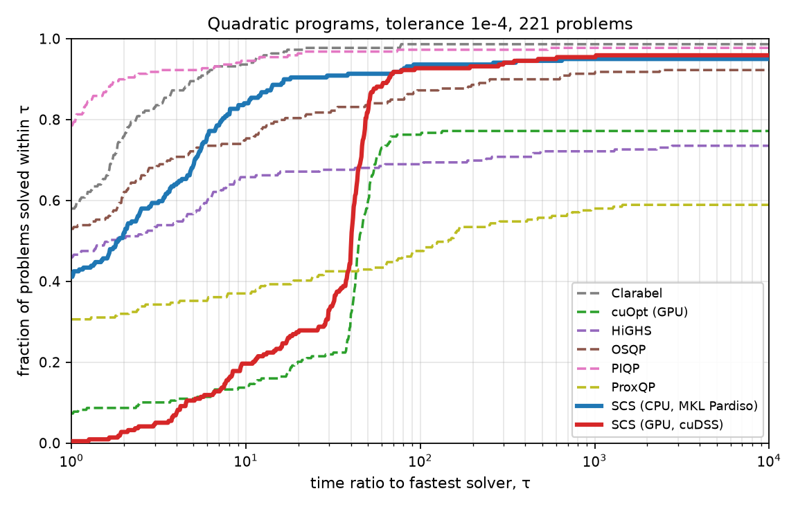

At the tighter :math:`10^{-6}` tolerance the interior-point solvers pull ahead,
as expected for a first-order method, but SCS still verifies more solutions
than every solver other than PIQP and Clarabel, and remains the fastest
first-order solver by a wide margin.

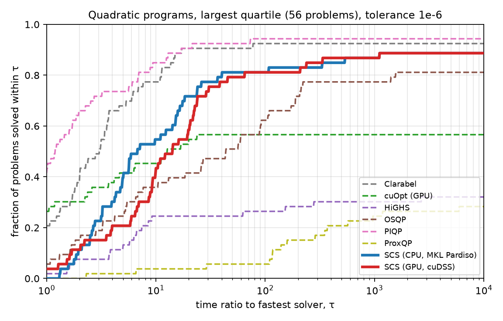

.. list-table:: QP: verified solves and shifted geometric mean time (s); all 221 problems / largest quartile (56)
   :header-rows: 1
   :widths: 26 12 12 12 12 12 12 12 12

   * - Solver
     - solved 1e-4
     - gm 1e-4
     - solved 1e-4 (largest)
     - gm 1e-4 (largest)
     - solved 1e-6
     - gm 1e-6
     - solved 1e-6 (largest)
     - gm 1e-6 (largest)
   * - Clarabel
     - 216
     - 2.2
     - 52
     - 9.7
     - 212
     - 3.0
     - 49
     - 13.9
   * - PIQP
     - 214
     - 2.5
     - 50
     - 11.4
     - 214
     - 2.5
     - 50
     - 11.4
   * - SCS (GPU, cuDSS)
     - 210
     - 4.4
     - 53
     - 8.2
     - 204
     - 7.9
     - 47
     - 23.6
   * - SCS (CPU, MKL Pardiso)
     - 208
     - 5.0
     - 53
     - 10.5
     - 202
     - 7.3
     - 47
     - 25.0
   * - OSQP
     - 202
     - 7.0
     - 46
     - 23.4
     - 185
     - 15.9
     - 43
     - 45.6
   * - cuOpt (GPU)
     - 169
     - 22.1
     - 35
     - 58.8
     - 163
     - 25.2
     - 30
     - 80.8
   * - HiGHS
     - 161
     - 28.1
     - 24
     - 163.6
     - 144
     - 43.2
     - 17
     - 286.9
   * - ProxQP
     - 129
     - 69.8
     - 24
     - 212.2
     - 125
     - 76.6
     - 15
     - 425.8

.. _bench_lp:

Linear programs
---------------

345 problems: Netlib, Kennington, the MIPLIB 2017 LP relaxations up to 20 MB
and the Mittelmann LP set. SCS is not an LP solver and is not marketed as one,
so this comparison is included mainly to show that it is not a bad one: on the
largest quarter of the LP set SCS with cuDSS verifies as many solutions as
HiGHS (dual simplex) and is second only to it in geometric mean time, ahead of
the interior-point solvers PIQP and Clarabel. Both PDLP implementations, which
are first-order LP methods, trail SCS by a wide margin under independent
verification (see the notes below).

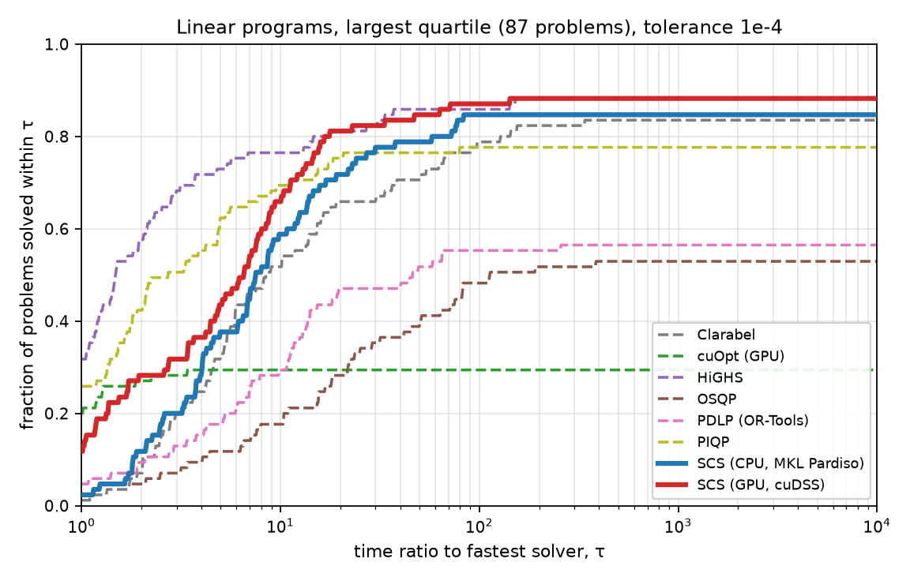

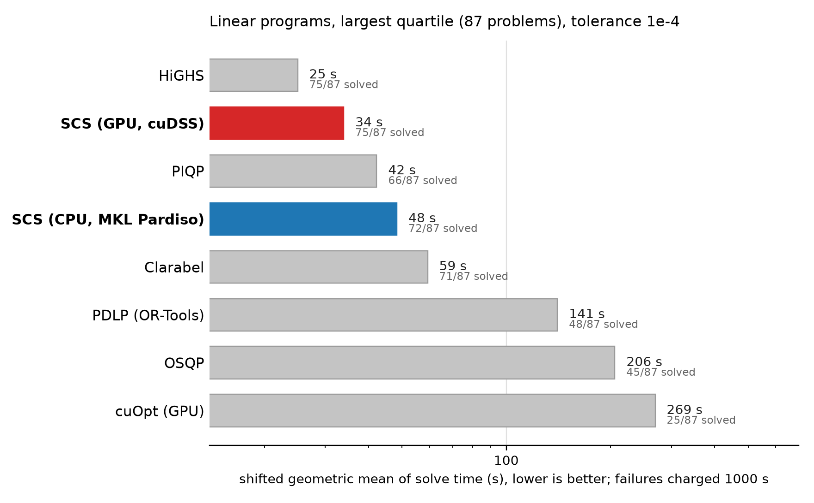

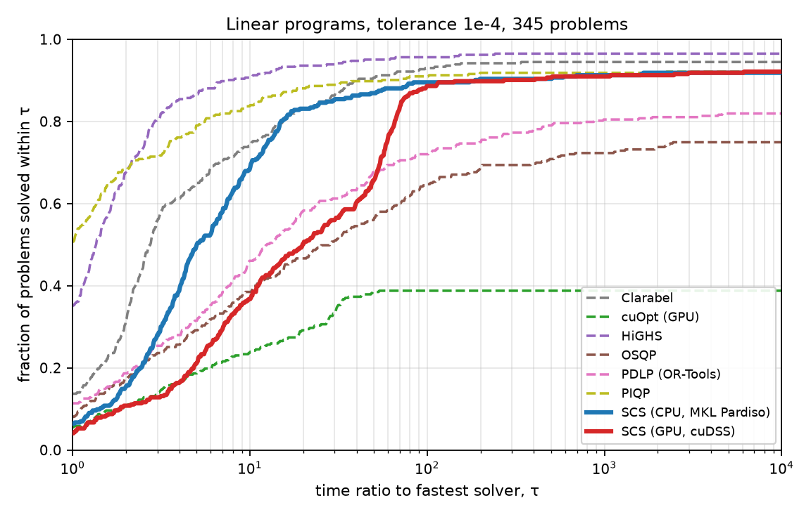

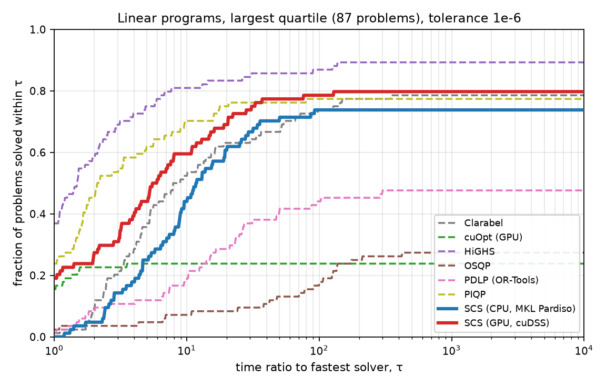

.. list-table:: LP: verified solves and shifted geometric mean time (s); all 345 problems / largest quartile (87)
   :header-rows: 1
   :widths: 26 12 12 12 12 12 12 12 12

   * - Solver
     - solved 1e-4
     - gm 1e-4
     - solved 1e-4 (largest)
     - gm 1e-4 (largest)
     - solved 1e-6
     - gm 1e-6
     - solved 1e-6 (largest)
     - gm 1e-6 (largest)
   * - HiGHS
     - 331
     - 4.8
     - 75
     - 25.0
     - 331
     - 4.8
     - 75
     - 25.0
   * - PIQP
     - 316
     - 8.6
     - 66
     - 42.2
     - 310
     - 9.8
     - 65
     - 43.0
   * - Clarabel
     - 324
     - 9.5
     - 71
     - 59.2
     - 312
     - 12.4
     - 66
     - 72.7
   * - SCS (GPU, cuDSS)
     - 316
     - 10.8
     - 75
     - 33.9
     - 299
     - 16.5
     - 67
     - 49.0
   * - SCS (CPU, MKL Pardiso)
     - 315
     - 11.0
     - 72
     - 48.3
     - 295
     - 18.9
     - 62
     - 79.2
   * - PDLP (OR-Tools)
     - 281
     - 23.9
     - 48
     - 140.5
     - 173
     - 129.9
     - 40
     - 227.8
   * - OSQP
     - 257
     - 41.0
     - 45
     - 205.9
     - 177
     - 132.0
     - 23
     - 484.3
   * - cuOpt (GPU)
     - 133
     - 164.5
     - 25
     - 269.2
     - 123
     - 188.3
     - 20
     - 346.3

.. _bench_sdp:

Semidefinite programs
---------------------

98 problems: SDPLIB and the Mittelmann SDP set. This is the family where an
interior-point method is usually the right choice, and the plots say so: SDPA
and CVXOPT solve the small, ill-conditioned ``control``, ``truss``, ``arch``
and ``gpp`` instances in seconds where SCS needs hundreds of thousands of
iterations and often hits the 900 s limit. SCS is the fastest solver on the
large sparse combinatorial relaxations (``theta``, ``mcp``, ``maxG``, ``qpG``
and ``equalG``), where the interior-point methods either run out of time or,
in Clarabel's case, cannot form the dense scaling block at all. The GPU does
not help on SDPs: the time is spent in the eigendecompositions of the cone
projection, not in the linear system.

If your problem has a few large PSD blocks and moderate accuracy is enough,
SCS is a good choice; if it has many small blocks or is badly conditioned, use
an interior-point solver.

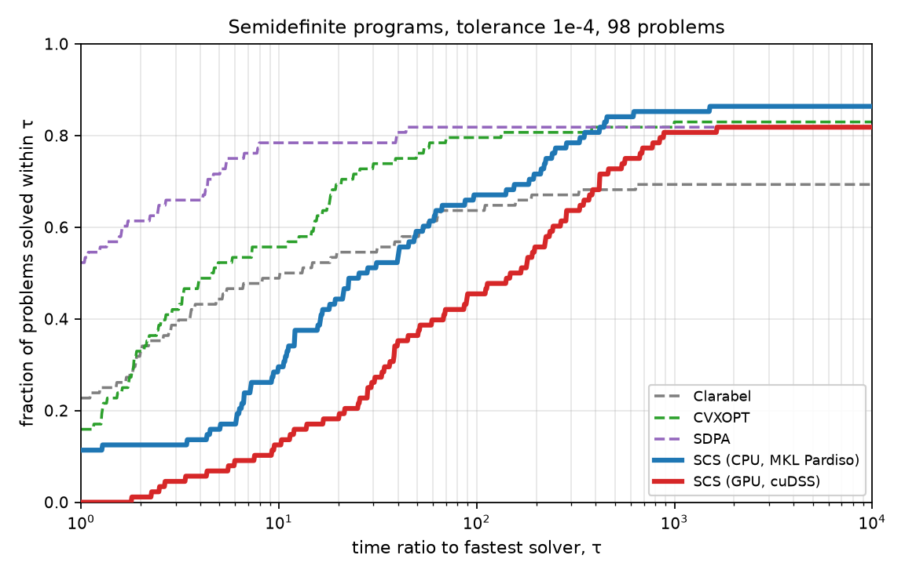

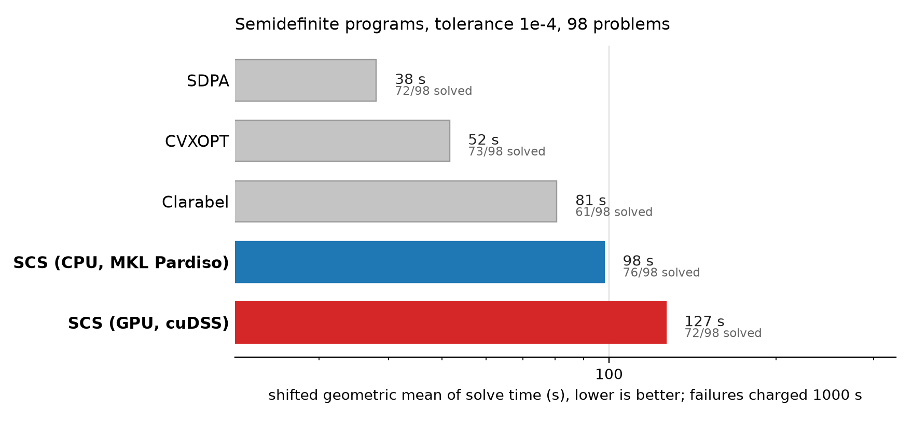

.. list-table:: SDP: verified solves and shifted geometric mean time (s); all 98 problems / largest quartile (28)
   :header-rows: 1
   :widths: 26 12 12 12 12 12 12 12 12

   * - Solver
     - solved 1e-4
     - gm 1e-4
     - solved 1e-4 (largest)
     - gm 1e-4 (largest)
     - solved 1e-6
     - gm 1e-6
     - solved 1e-6 (largest)
     - gm 1e-6 (largest)
   * - SDPA
     - 72
     - 38.0
     - 23
     - 35.5
     - 66
     - 53.5
     - 23
     - 35.5
   * - CVXOPT
     - 73
     - 51.6
     - 22
     - 62.4
     - 59
     - 108.0
     - 20
     - 88.4
   * - Clarabel
     - 61
     - 80.5
     - 16
     - 140.3
     - 47
     - 139.1
     - 11
     - 240.2
   * - SCS (CPU, MKL Pardiso)
     - 76
     - 98.0
     - 18
     - 674.2
     - 50
     - 192.1
     - 2
     - 989.5
   * - SCS (GPU, cuDSS)
     - 72
     - 126.6
     - 13
     - 832.2
     - --
     - --
     - --
     - --

.. _bench_lpbig:

Large linear programs: the Mittelmann set
-----------------------------------------

The LP test sets above are dominated by small and medium instances, so we also
ran the 37 problems of `Hans Mittelmann's LP benchmark set
<https://plato.asu.edu/ftp/lptestset/>`_, the standard collection of large,
hard LPs: between 100,000 and 126 million nonzeros, with several instances of
10 to 40 million variables. Every solver ran at tolerance :math:`10^{-4}`
with an 1800 s limit in 64 GB containers (4 cores, or an A100 80GB for the two
GPU solvers). Mittelmann's own runs allow several hours per instance and use
faster machines, so the simplex and interior-point codes time out here far
more often than they do in his tables; the point of this set for us is the
size of the problems, not a re-run of his benchmark.

This is where the cuDSS backend pays off. SCS on the GPU verifies more
solutions than any other solver and has by far the lowest geometric mean
time, and SCS on the CPU is second. The two other first-order codes, PDLP and
cuOpt, are the natural comparison: OR-Tools PDLP verifies about two thirds as many
solutions as SCS with cuDSS, and cuOpt's PDLP, although it reports almost
every instance optimal, mostly fails the independent residual check (see the
notes below).

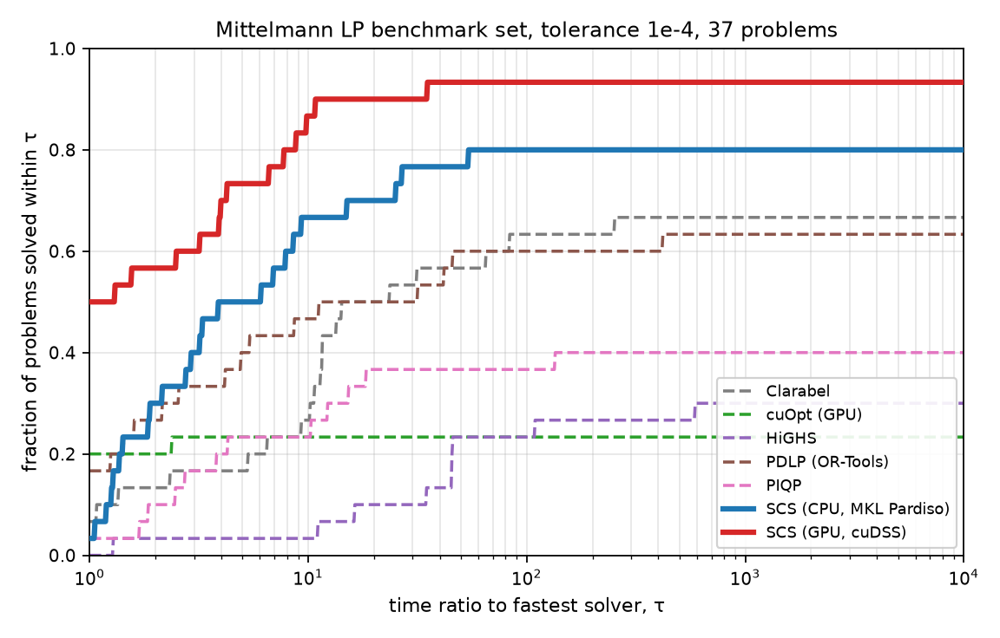

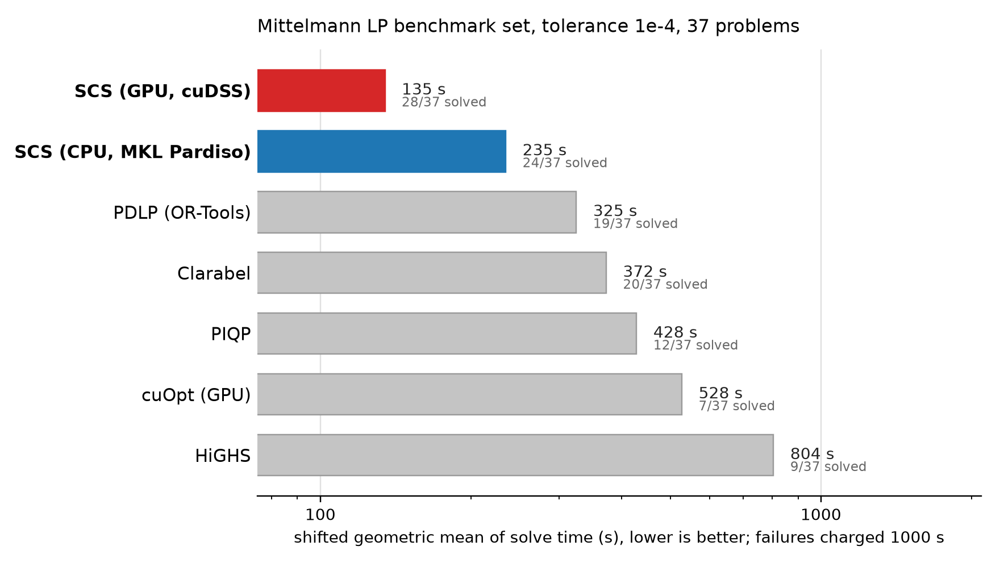

.. list-table:: Mittelmann LP set: verified solves out of 37 and shifted geometric mean time (s), tolerance 1e-4, 1800 s limit
   :header-rows: 1
   :widths: 40 20 20

   * - Solver
     - verified solves
     - geometric mean (s)
   * - SCS (GPU, cuDSS)
     - 28
     - 135
   * - SCS (CPU, MKL Pardiso)
     - 24
     - 235
   * - PDLP (OR-Tools)
     - 19
     - 325
   * - Clarabel
     - 20
     - 372
   * - PIQP
     - 12
     - 428
   * - cuOpt (GPU)
     - 7
     - 528
   * - HiGHS
     - 9
     - 804

Set-specific exclusions: Clarabel could not attempt ``L1_sixm250obs`` and
``L1_sixm1000obs`` within 64 GB (counted as failures); OR-Tools PDLP cannot
load ``Dual2_5000`` and ``dlr2`` because the model exceeds the 2 GB protobuf
limit (counted as failures); SCS with cuDSS ran out of GPU memory on
``thk_48`` (counted as a failure). Four instances (``bdry2``, ``Linf_520c``
and the two ``L1_sixm`` problems) are distributed in Netlib's compressed EMPS
format and were decoded with ``emps`` before use.

Notes on individual solvers
---------------------------

* **SCS.** A few SCS "solved" returns fail the independent residual check
  and count as failures above. Two of them are real false certificates
  (``QGROW7`` and ``QGROW22`` from Maros-Meszaros, and the MIPLIB relaxation
  ``neos-4413714-turia``): on these badly scaled problems the diagonal
  rescaling drives the internal scale to its floor, and the scaled residuals
  SCS monitors no longer track the unscaled ones. The rest (``PRIMALC8``,
  ``QSCFXM2``, ``greenbea``, the ``pilot`` family) are marginal, with
  residuals between one and four times the :math:`10^{-3}` cut. The same
  check promotes SCS solves that hit the time limit with residuals inside ten
  times the tolerance; those are counted as solved at the time limit, which
  is what makes the SCS curves on the SDP profile reach the right edge.
* **cuOpt.** cuOpt's LP path is PDLP with an L2-relative stopping rule, and on
  problems with many variable bounds (Kennington, MIPLIB) its returned duals
  often have large infinity-norm stationarity residuals even though cuOpt
  reports the solve as optimal, and even though its own reported absolute
  dual residual is in the tens or hundreds. Under the uniform check used here
  those solves count as failures; by its own status cuOpt reports 233 of the
  345 LPs optimal at :math:`10^{-4}`, and 36 of the 37 Mittelmann instances,
  of which only 7 pass the check. Its QP path is a barrier method
  whose solutions verify cleanly. We used cuOpt 26.8.0 with default settings apart
  from the tolerance and time limit.
* **PDLP (OR-Tools).** The same L2-relative termination rule applies, with a
  milder effect: 26 of its 307 "optimal" LP returns at :math:`10^{-4}` have
  infinity-norm residuals between :math:`10^{-3}` and :math:`10^{-2}`.
* **HiGHS.** Its QP solver is an active-set method and is slow on the larger
  QPs; its LP simplex is the fastest LP code in the comparison.
* **ProxQP.** Run with its default dense/sparse backend selection; it times
  out on many of the larger problems.
* **Clarabel.** Cannot attempt PSD cones of order 500 or more (it forms a
  dense scaling block); those instances are counted as failures.
* **SDPA and CVXOPT.** Interior-point SDP solvers; SDPA has no time limit and
  ran to completion on every instance.
