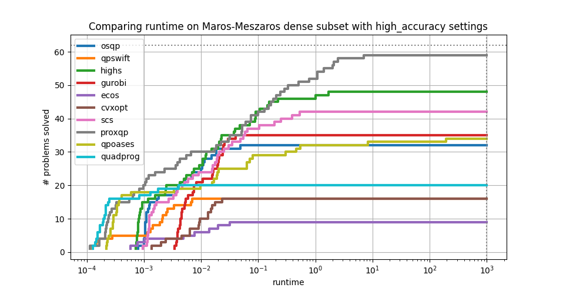

.. scs documentation master file, created by
   sphinx-quickstart on Sat Jul 24 12:54:37 2021.
   You can adapt this file completely to your liking, but it should at least
   contain the root `toctree` directive.

.. image:: _static/scs_logo_transparent.png
  :width: 400
  :alt: SCS
  :align: center
  :target: https://github.com/cvxgrp/scs

.. title:: SCS

.. centered::
  **A fast, reliable, and open-source convex cone solver.**

SCS (Splitting Conic Solver) is a numerical optimization package for solving
large-scale convex quadratic cone problems. The code is freely available on
`GitHub <https://github.com/cvxgrp/scs>`_.  It solves primal-dual problems of
the form

.. math::
  \begin{array}{lcr}
  \begin{array}{ll}
  \mbox{minimize} & (1/2)x^\top  P x + c^\top  x\\
  \mbox{subject to} &  Ax + s = b\\
    & s \in \mathcal{K}
  \end{array}
  &\quad&
  \begin{array}{ll}
  \mbox{maximize} & -(1/2)x^\top  P x - b^\top  y\\
  \mbox{subject to} &  Px + A^\top y + c = 0\\
    & y \in \mathcal{K}^*
  \end{array}
  \end{array}

over variables

.. list-table::
   :widths: 20 20
   :header-rows: 0

   * - :math:`x \in \mathbf{R}^n`
     - primal variable

   * - :math:`y \in \mathbf{R}^m`
     - dual variable

   * - :math:`s \in \mathbf{R}^m`
     - slack variable

with data

.. list-table::
   :widths: 20 50
   :header-rows: 0

   * - :math:`A \in \mathbf{R}^{m \times n}`
     - sparse data matrix, see :ref:`matrices`
   * - :math:`P \in \mathbf{S}_+^{n}`
     - sparse, symmetric positive semidefinite matrix
   * - :math:`c \in \mathbf{R}^n`
     - dense primal cost vector
   * - :math:`b \in \mathbf{R}^m`
     - dense dual cost vector
   * - :math:`\mathcal{K} \subseteq \mathbf{R}^m`
     - nonempty, closed, convex cone, see :ref:`cones`
   * - :math:`\mathcal{K}^* \subseteq \mathbf{R}^m`
     - dual cone to :math:`\mathcal{K}`

At termination SCS will either return points :math:`(x^\star,y^\star,s^\star)` that satisfies
the :ref:`optimality conditions <optimality>` to the desired accuracy, or a certificate
of :ref:`primal or dual infeasibility <infeasibility>` to the designated infeasibility accuracy.

.. The current version is |version|

Features
--------

* **Efficient**: Designed to scale to large problems.
* **Flexible**: Supports quadratic objectives and a large range of :ref:`cones <cones>`.
* **Free and open source**: Distributed under the permissive `MIT license <https://github.com/cvxgrp/scs/blob/master/LICENSE.txt>`_.
* **Detects infeasibility**: Robustly and reliably detects :ref:`infeasible <infeasibility>` problems.
* **Interfaces**: Bindings for many :ref:`languages <interfaces>`, including C, Python, Julia, R, MATLAB, Ruby, and JavaScript via WebAssembly.
* **Warm starts**: Easily :ref:`warm-started <warm_start>`, and the matrix factorization can be cached.
* **Matrix-free**: Optionally use an :ref:`indirect linear system solver <indirect>`, or a :ref:`GPU version <gpu_indirect>`.
* **Supported**: A supported solver in `CVX <http://cvxr.com/cvx/>`_, `CVXPY <https://github.com/cvxgrp/cvxpy>`_, `YALMIP <https://github.com/johanlofberg/YALMIP>`_, `Convex.jl <https://github.com/jump-dev/Convex.jl>`_  and `JuMP <https://github.com/jump-dev/JuMP.jl>`_.
* **Accelerated**: Includes :ref:`acceleration <acceleration>` that can improve convergence to high accuracy.
* **Battle-tested**: The first ADMM-based solver available, and in wide usage.

Performance
-----------

SCS is a fast and reliable optimization library. For instance, it is one of the
most performant solvers as determined by the third-party `QP solvers benchmark
<https://github.com/qpsolvers/qpbenchmark>`_ on the challenging Maros-Meszaros
QP test suite. This is despite SCS being a general quadratic conic solver and
not specifically tailored for QPs.

   SCS is faster and more reliable than most other solvers.

Development
-----------

SCS is a community project, built from the contributions of many
researchers and engineers. The primary maintainer is
`Brendan O'Donoghue <https://bodono.github.io/>`_.
We appreciate all contributions. To get involved, see our :doc:`contributing
guide </contributing/index>`.

.. toctree::
   :hidden:
   :maxdepth: 2

   algorithm/index
   api/index
   install/index
   linear_solver/index
   blas_lapack/index
   examples/index
   contributing/index
   help/index
   citing/index

